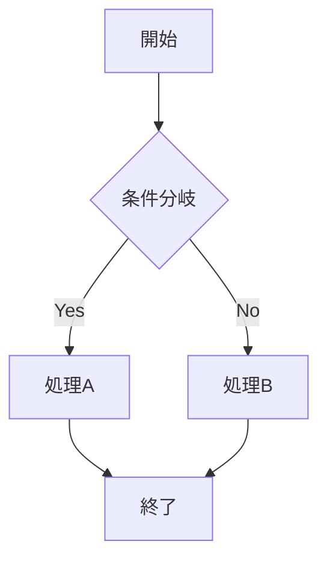
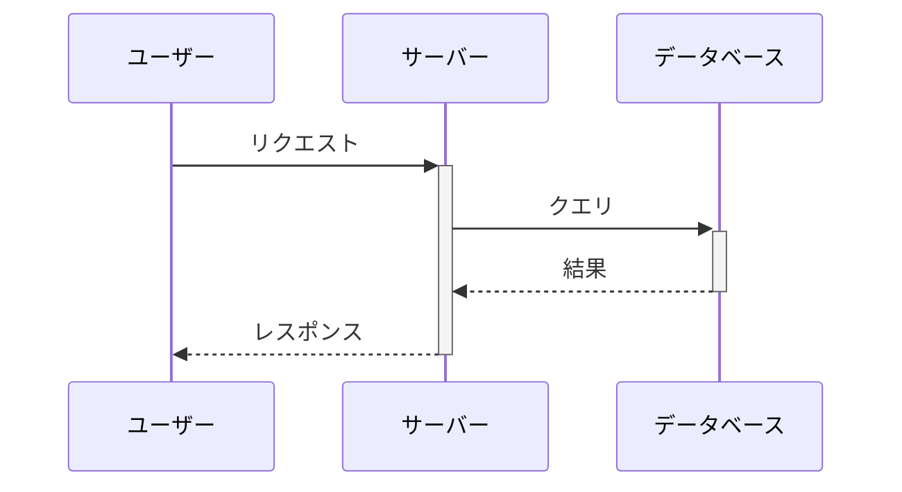
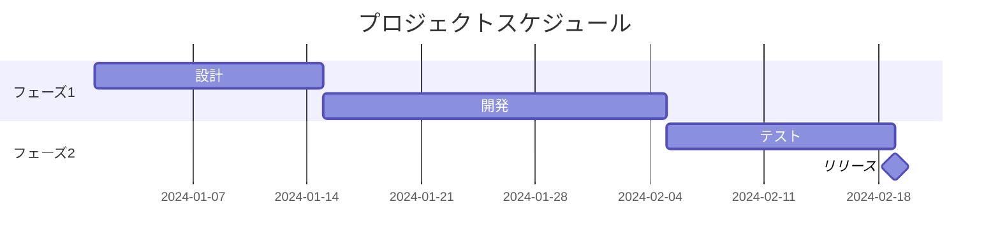

# Welcome to MkDocs

For full documentation visit [mkdocs.org](https://www.mkdocs.org).

## Commands

- `mkdocs new [dir-name]` - Create a new project.
- `mkdocs serve` - Start the live-reloading docs server.
- `mkdocs build` - Build the documentation site.
- `mkdocs -h` - Print help message and exit.

## Project layout

    mkdocs.yml    # The configuration file.
    docs/
        index.md  # The documentation homepage.
        ...       # Other markdown pages, images and other files.

## Mermaid 図

スニペット: `mermaid` または `フロー`

### フローチャート

````markdown

````


### シーケンス図

スニペット: `sequence` または `シーケンス`

````markdown

````


### ガントチャート

スニペット: `gantt` または `ガント`

````markdown

````


```python
print(Hello World.)
```
